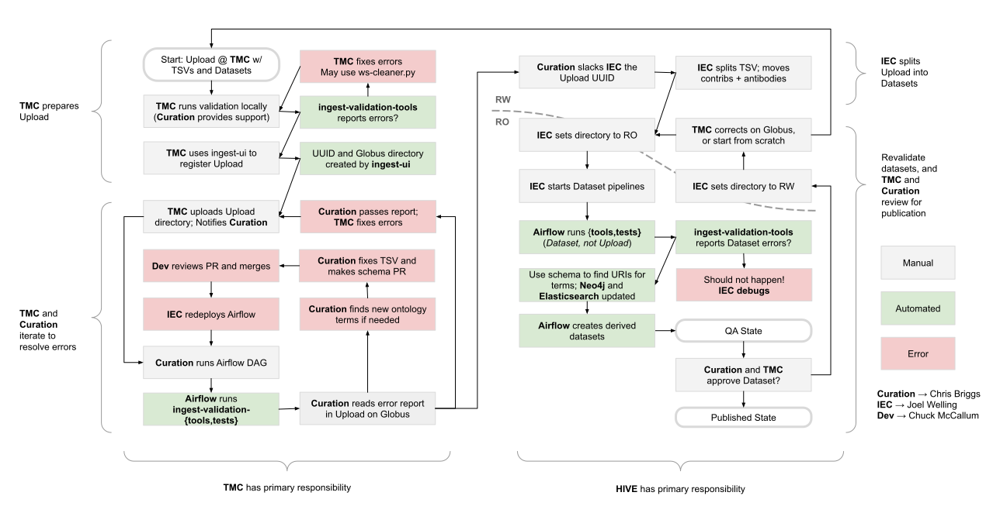
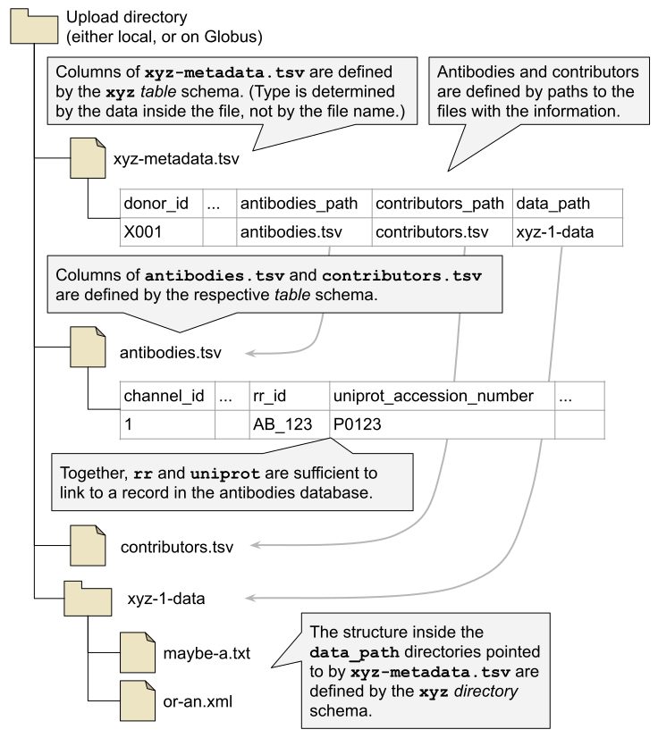
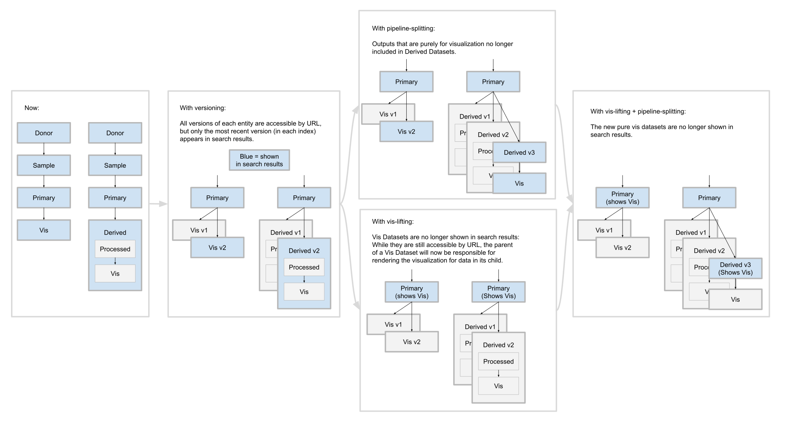
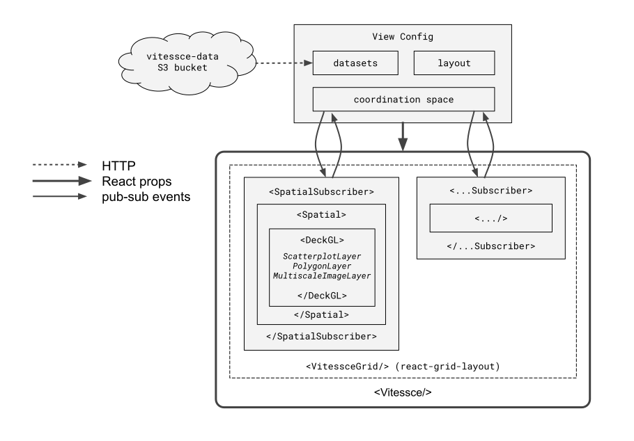

Taking the time to diagram processes and architectures has helped me to clarify my understanding,
and when incorporated into the documentation, has helped to ensure that developers, managers, and users
are all going in the same direction.
These are a sample of the diagrams I've created to explain and clarify our work.

## Process

In the prototype phase of HuBMAP, the formats for submissions were not well specified,
and developers based their pipelines off the example data coming in from the labs.
As we moved into a production phase, we needed to clarify the responsibilities of all teams,
and take a stricter approach, so if submissions fail validation, it's the responsibility of the provider to fix errors.

## Directory structure

HuBMAP submissions have defined structures both for metadata TSVs, and for data directories.
The details of each are examined separately, but this is a high-level diagram that demonstrates
how one relates to the other.

## Planning

Often there a multiple possible ways that a problem could be solved,
but different parties might be exposed to different costs and benefits.
Having a set of diagrams that we could look at together has been critical
to making sure that we were talking about the same thing,
and were able to see the consequences of a particular implementation decision.

## Architecture

<a href="http://beta.vitessce.io/">Vitessce</a> uses both prop passing through composed react components, and pub-sub
communication between coordinated components.
As the architecture of Vitessce has evolved, this high-level diagram has also evolved, and helped to keep developers
on the same page.

